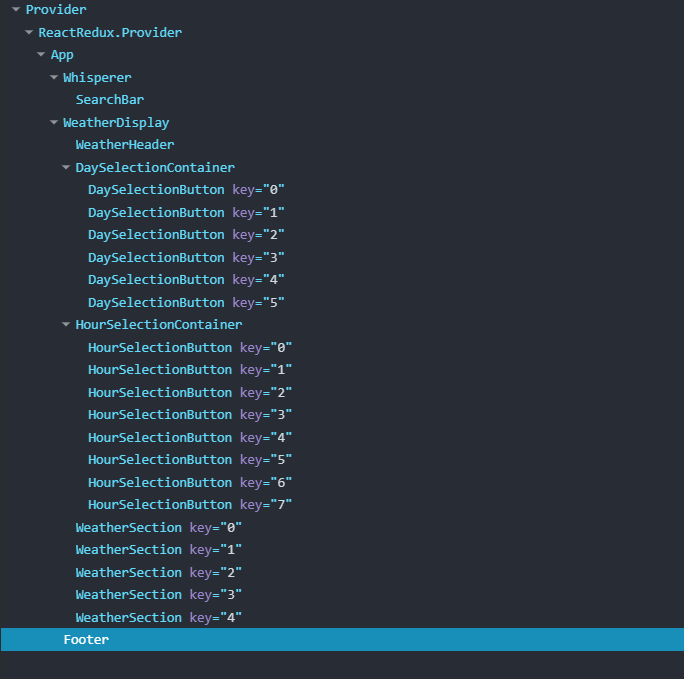

## Weather App
Weather app allows users to search for cities and view realtime weather information.

## Instalation
1. Install project
2. Run `npm install` in terminal
3. Create .env file in project and type VITE_API_KEY={Your API Key}
4. Run `npm run dev`
5. You can see application on http://localhost:5173/

## Technologies
### Development
Vite
TypeScript
React
Redux

### Styling
Sass

## Supported browsers
Mozilla Firefox
Google Chrome
Microsoft Edge

## Description
Simple application to show weather forcast. User finds city that he want's to see weather forecast in searchbar. Searchbar whispers user cities based on text user writes. Data for for whispering are from JSON file from Open Weather Map.

After user's choice current weather information from Open Weather Map API are shown to user. 

## Components
### Whisperer
Whisperer is made out of two other components (SearchBar, SearchBarTable).
User input is stored in Whisperer component and is spred out to other components.
By default 5 items are selected from JSON file based on user input and then are shown in table.
User can click on item, what happens depends on desired function declared above Whisperer component.

When user inputs text, first thing that happens is that program is trying to select cities that beggin with that query, then
program tries to find other cities that include that query.
Finally these data are combined and sliced based on limit, ready to be displayed.

Searches are stores via useMemo() for better performace.
For input i choosed useDeferredValue(), to optimize performace when handling fast input changes.

Whole component is designed to be reusable for other JSON files.

In our example:
User is searching cities, on display we can se name of the city and country where city lays. It is because
a lot cities share the same name, so it is more readable for user.

When user clicks on city, search bar is cleared out and city is save in store.

### NoState components
When no city is selected NoState components is shown. It informs users about next steps also there is a button that allows user to select city based on his location.

Location is read from navigator upon user agreement. Then city is read from openweathermap - reverse geocoding API.

### Displaying weather
I created component WeatherDisplay that shows information about current weather and forecast for 5 days ahead. Data are being fetched from openweatherapp API based on selected city from Whisperer component. Data from API are store in Redux store (weatherSlice.ts).When no city is selected NoState component is shown to inform user about next steps. User can also choose city based on his location.

WeatherHeader shows city name, current temperature and current information about how the sky looks like (Clear, Clouds, etc.). WeatherHeader is dynamic and changes background color based on sky information, for example when the sky is clear background color of the component is turqoise, when it is windy background color is light gray.

WeatherSection is component that shows any data and shows them in a box. Data with units and title are stored in sections.ts file, where are data easily changable and whole component is more readable. Boxes are rendered in grid pattern based on screen size.

The rest components WeatherDisplay contains are Day and Hour selection containers that handles data from API and allows user to filter data based on day and hour. Time is based on user timezone.

### Components Structure

